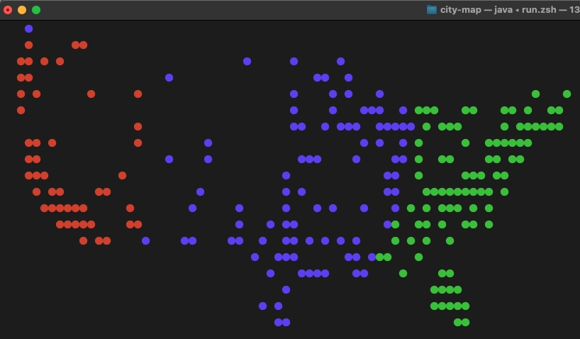
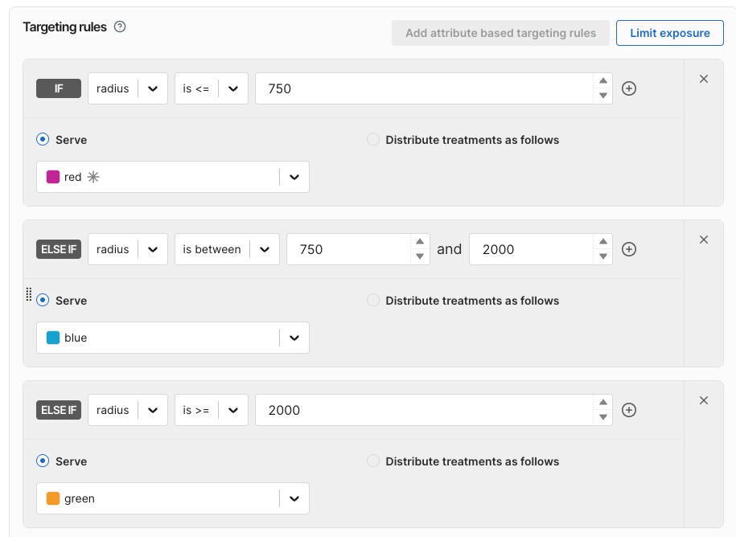

* City Map Java SDK Demonstration




To run..

```
export FME_SERVER_SIDE_API_KEY="<your server-side api key>"
mvn clean install
mvn exec:java
```

I ran with command-line Maven.  You can run from an IDE.

```
map_of_cities
```


The flag has no dynamic config, but the fun comes in using a "radius" attribute.  Radius is a number. All the cities in the demo are evaluated with a radius attribute reflecting their distance from San Francisco.

The user interface is in the console window, a map of the US with colored dots reflecting the feature rollout.

David Martin

